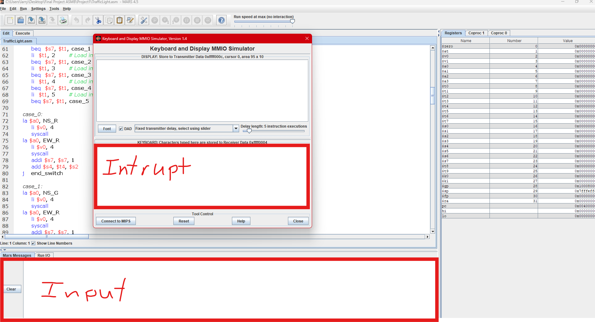

Traffic Light Simulator in MARS 4.5

1. Open the TrafficLight.asm file in MARS 4.5.
2. Inside of MARS 4.5, go to the top menu and open Tools > Keyboard and Display MMIO Simulator, then make sure to press "Connect to MIPS".
3. Assembly the simulation.
4. **VERY IMPORTANT** When promopted for data, type into **RUN I/O**, and not the **Keyboard Window**
5. Once the simulator has started, you can type into the **Keyboard and Display MMIO Simulator** to enable intrupts.
- pressing 'q' will quit the program
- pressing 'e' will allow you to edit at runtime. (Switch from the **Keyboard and Display MMIO Simulator** to **RUN I/O**.

  If you try to input via the Keyboard Window when prompts in the RUN I/O, the program will crash.

